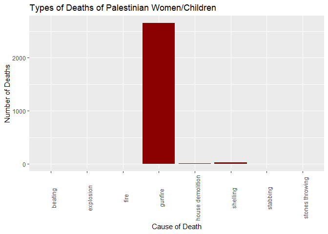

Palestine-Israel before Oct 7
================
Brett Skinner
2023-12-17

# Notes

- this dataset does not distinguish between Palestinian civilian and
  Hamas the same way it distinguishes IDF from Israeli civilian
  (killed_by column).

- This dataset does not distinguish between Isreali civilian deaths and
  IDF deaths, nor does it distinguish between Palestinian civilian
  deaths and Hamas deaths.

``` r
library(tidyverse)
IPdata <- read_csv("fatalities_isr_pse_conflict_2000_to_2023.csv")
```

    ## Rows: 11124 Columns: 16
    ## ── Column specification ─────────────────────────────────────────────────────────────────────────────────────────────────
    ## Delimiter: ","
    ## chr  (13): name, citizenship, event_location, event_location_district, event_location_region, gender, took_part_in_th...
    ## dbl   (1): age
    ## date  (2): date_of_event, date_of_death
    ## 
    ## ℹ Use `spec()` to retrieve the full column specification for this data.
    ## ℹ Specify the column types or set `show_col_types = FALSE` to quiet this message.

``` r
View(IPdata)
IPdata$year <- format(as.Date(IPdata$date_of_event, format = "%Y/%m/%d"), "%Y")
```

``` r
IP_deaths <-filter(IPdata, citizenship=="Palestinian" | citizenship=="Israeli")
View(IP_deaths)

WC_deaths <- filter(IP_deaths, age < 18 | gender == "F")
View(WC_deaths)
```

IP_deaths is a dataframe for the deaths of only Israeli and Palestinian
citizens and WC_deaths is for deaths of Israeli and Palestinian
women/children

``` r
ggplot(data = IP_deaths) + 
  geom_bar(mapping = aes(x = year, fill = citizenship), position = "dodge") + 
  scale_fill_manual("Citizenship", values = c("Israeli" = "darkgreen", "Palestinian" = "darkred")) + 
  theme(axis.text.x = element_text(angle = 90)) +
  xlab("Year") + 
  ylab("Number of Deaths") 
```

<!-- -->

# Context

This shows an escalation of the conflict over time until Oct. 7.

- 2000 - Palestinians are becoming increasingly angry over successive
  Israeli governments refusal to obide by the Oslo accords.

- 2000 - Ariel Sharon, an Israeli opposition leader, stormed al-Aqsa
  Mosque in occupied East Jerusalem with more than 1000 police/soldiers,
  instigating the beginning of the second intifada.
  <https://www.aljazeera.com/news/2020/9/28/palestinian-intifada-20-years-later-israeli-occupation-continues>

- 2002 - The Passover Massacre - A terrorist attack kills 30 people at a
  passover celebration. In response Israel launches Operation Defensive
  Shield.

- 2002 - The wall between Israel and the west bank begins construction
  cutting into Palestinian territory to protect Israel citizens and
  settlements.

- 2005 - Second Intifada ends and Israel begins its withdrawal of the
  settlers and ilitary forces from Gaza.

- 2006 - Hamas wins election defeating Fatah. a deal is made to govern
  West Bank and Gaza together.

- 2007 - Hamas takes over Gaza after the deal to govern together fails.

- 2008 - 2014 - Wars in Gaza: Israel breaks a ceasefire with Hamas 6
  months after agree to it launching a raid to kill Hamas militants.
  Israel decides to “launch Operation Cast Lead, a weeks-long assault on
  Gaza involving aerial bombing and a ground invasion”. During this
  period “UN determines Israeli military committed war crimes and
  humanity in the operation, including using white phosphorus in
  populated areas and intentionally targeting civilians.” The UN also
  determined “Palestinian militants had also committed war crimes by
  shooting rockets at Israeli civilians.” In 2012 violence again flared
  up after an increase in rockets being launched into Israel from Gaza.
  A cease fire was brokered until 2014 when violence broke out again
  after Hamas kidnapped and killed 3 Israeli teens from the West Bank.
  Israel then launched airstrikes, a ground invasion and blockaded Gaza,
  killing thousands, mostly civilians.
  <https://www.vox.com/world-politics/23921529/israel-palestine-timeline-gaza-hamas-war-conflict>

- 2018 - The March of Return starts on 30 March calling for Israel to
  lift the illegal 11-year blockade on Gaza. Despite the protests being
  peaceful, Israeli soldiers killed many protesters over the 18 months
  of protests.
  <https://www.amnesty.org/en/latest/campaigns/2018/10/gaza-great-march-of-return/>

- 2021 - Israel threatens to evict Palestinian families from their homes
  in East Jerusalem and impose restrictions around al-Asqa Mosque during
  Ramadan. Violent clashes occur between protesters and Israeli police.
  Hamas fires rockets, and Israel responds with airstrikes killing more
  than 200 Palestinian civilians.
  <https://www.vox.com/world-politics/23921529/israel-palestine-timeline-gaza-hamas-war-conflict>

- 2023 - This dataset does not include any data beyond late September
  2023

``` r
ggplot(data = filter(WC_deaths, citizenship == "Israeli" | citizenship == "Palestinian")) + 
  geom_bar(mapping = aes(x = year, fill = citizenship), position = "dodge") + 
  scale_fill_manual("Citizenship", values = c("Israeli" = "darkgreen", "Palestinian" = "darkred")) + 
  theme(axis.text.x = element_text(angle = 90)) + 
  xlab("Year") + 
  ylab("Number of Deaths") + 
  ggtitle("Deaths of Women/Children")
```

<!-- -->

``` r
Isr_WC_percent <- round(nrow(filter(WC_deaths, citizenship == "Israeli"))/nrow(filter(IP_deaths,citizenship == "Israeli")), digits = 2)
Pal_WC_percent <- round(nrow(filter(WC_deaths, citizenship == "Palestinian"))/nrow(filter(IP_deaths, citizenship == "Palestinian")), digits = 2)
```

The raw numbers of women and children killed in the conflict.

- 39% of the Isreali deaths are women/children

- 27% of the Palestinian deaths are women/children.

Let’s look at the method of death of the women/children

``` r
ggplot(data = filter(WC_deaths, citizenship == "Israeli" & !is.na(type_of_injury ))) + 
  geom_bar(mapping = aes(x = type_of_injury, fill = citizenship), fill = "darkgreen") + 
  theme(axis.text.x = element_text(angle = 90)) + 
  xlab("Cause of Death") + 
  ylab("Number of Deaths") + 
  ggtitle( "Types of Deaths of Israeli Women/Children")
```

<!-- -->

``` r
ggplot(data = filter(WC_deaths, citizenship == "Palestinian" & !is.na(type_of_injury ))) + 
  geom_bar(mapping = aes(x = type_of_injury, fill = citizenship), fill = "darkred") + 
  theme(axis.text.x = element_text(angle = 90)) + 
  xlab("Cause of Death") + 
  ylab("Number of Deaths") + 
  ggtitle( "Types of Deaths of Palestinian Women/Children")
```

<!-- -->

This gives us insight into why the Israeli casualties have a higher
percentage of women and children. Most of the Isreali deaths are by
explosions which are likely rockets being launched indiscriminately into
populated areas of Israel, whereas the vast majority of deaths of women
and children on the Palestinian side are by gunfire, which means someone
has to be willing to pull the trigger on women or children.

``` r
ggplot(data = IP_deaths) + 
  geom_bar(mapping = aes(x = type_of_injury, fill = citizenship)) + 
  scale_fill_manual("Citizenship", values = c("Israeli" = "darkgreen", "Palestinian" = "darkred")) +
  theme(axis.text.x = element_text(angle = 90)) + 
  xlab("Cause of Death") + 
  ylab("Number of Deaths") + 
  facet_wrap("citizenship")
```

<!-- -->

We compare the different methods for which people were killed, and
unsurprisingly, gunfire is by far the most.

``` r
IP_deaths$type_of_injury[IP_deaths$type_of_injury=="physically assaulted" | IP_deaths$type_of_injury=="beating"]<-"physical assault"
deaths_Isr <- filter(IP_deaths, citizenship == "Israeli")
deaths_Pal <- filter(IP_deaths, citizenship == "Palestinian")
```

cleaning the data a little

here I’d like to look at the Cause of Death as a percentage of total
deaths.

``` r
IS_Type <- pull(count(filter(deaths_Isr, !is.na(type_of_injury)), type_of_injury, sort = TRUE), var = 1)  #vector holding death type (Israeli)
IS_count <- pull(count(filter(deaths_Isr, !is.na(type_of_injury)), type_of_injury, sort = TRUE), var = -1) #vector holding count of death type
Is_Percent <- data.frame(Type_of_injury = IS_Type, Percent = round(IS_count/sum(IS_count)*100,digits = 2))

Israeli_Percent_Plot <- ggplot(Is_Percent, aes(x = Type_of_injury, y=Percent)) + 
  geom_col(mapping = aes( y = Percent), fill = "darkgreen") + 
  theme(axis.text.x = element_text(angle = 90)) + 
  xlab("Cause of Death") + 
  ylab("Percent of Total Deaths") + 
  geom_text(aes(label = Percent), vjust = -.15, colour = "black") + 
  ggtitle("Percentage of Israeli Deaths by Mode")
print(Israeli_Percent_Plot)
```

<!-- -->

Showing the mode of deaths of Israeli citizens as a percentage
Explosions are the most, this makes sense since many of the deaths are
caused by rockets fired into Israel or fire fights with the IDF. I would
like to see a distinction between Hamas and Palestinian civilians, and
Israeli civilians and IDF, so the data can show a more complete picture.

# create a dataframe for plotting percentages (Palestinian)

``` r
Pal_Type <- pull(count(filter(deaths_Pal, !is.na(type_of_injury)), type_of_injury, sort = TRUE), var = 1) #vector holding death type (Palestinian)
Pal_count <- pull(count(filter(deaths_Pal, !is.na(type_of_injury)), type_of_injury, sort = TRUE), var = -1)#vector holding count of death type
Pal_Percent <- data.frame(Type_of_injury = Pal_Type, Percent = round(Pal_count/sum(Pal_count)*100, digits = 2))

Palestinian_Percent_Plot <- ggplot(Pal_Percent, aes(x = Type_of_injury, y=Percent)) + 
  geom_col(mapping = aes( y = Percent), fill = "darkred") + 
  theme(axis.text.x = element_text(angle = 90)) + 
  xlab("Cause of Death") + 
  ylab("Percent of Total Deaths") + 
  geom_text(aes(label = Percent), vjust = -.5, colour = "black") + 
  ggtitle("Percentage of Palestinian Deaths by Mode")
print(Palestinian_Percent_Plot)
```

<!-- -->

The vast majority of Palestinians die from gunfire. Most likely most of
these gunfire deaths are coming at the hands of the IDF, which is
verified in the next graphic.

``` r
#ggplot(data = IP_deaths) + 
#  geom_bar(mapping = aes(x = citizenship, fill = killed_by)) + 
#  scale_fill_manual("Killed By", values = c("Israeli" = "darkgreen", "Palestinian" = "darkred")) +
#  theme(axis.text.x = element_text(angle = 90)) + 
#  xlab("Cause of Death") + 
#  ylab("Number of Deaths") + 
#  facet_wrap("killed_by")

ggplot(data = IP_deaths) + 
  geom_bar(mapping = aes(x = killed_by, fill = citizenship)) + 
  scale_fill_manual("Citizenship", values = c("Israeli" = "darkgreen", "Palestinian" = "darkred")) +
  theme(axis.text.x = element_text(angle = 90)) + 
  xlab("Killed By") + 
  ylab("Number of Deaths") + 
  facet_wrap("citizenship")
```

<!-- -->

This graph is misleading since it doesn’t distinguish between Hamas and
Palestinian civilian populations. Here it shows that Israeli people are
killed by Palestinian civilians, but Hamas is a terrorist organization
and we shouldn’t group them together with all other Palestinian
civilians. I wanted to compare the number of deaths by civilians on each
side, but the numbers are skewed since Hamas is not a designation.

``` r
ggplot(data = filter(IP_deaths, type_of_injury == "shelling" | type_of_injury == "fire" | type_of_injury == "house demolition" | type_of_injury == "explosion")) + 
  geom_bar(mapping= aes(x = citizenship, fill = type_of_injury)) + 
  scale_fill_manual("Type of Injury", values = c("shelling" = "#ffcc00", "fire" = "#ff3300", "house demolition" = "#333366", "explosion" = "#663300")) + 
  theme(axis.text.x = element_text(angle = 90)) + 
  xlab("Citizenship") + 
  ylab("Number of Deaths")# + 
```

<!-- -->

``` r
  #facet_wrap("killed_by")
```

More Israeli citizens die due to explosive type injuries than
Palestinian (though this will likely change after 2023) than do
Palestinian. The main way for Hamas to attack Israel is using rockets,
but the main way for the IDF to attack Palestinian civilians is by using
their guns as we saw earlier. I am a little surprised by this, but my
perspective is tainted by the current violence in Gaza right now. A main
takeaway is that Israel is much more violent in 2023 than it has been in
the past when it comes to launching missiles.

``` r
ggplot(data = IP_deaths)  + 
  geom_bar(mapping = aes(x=event_location_region, fill = citizenship), position = "dodge") + 
  scale_fill_manual("Citizenship", values = c("Israeli" = "darkgreen", "Palestinian" = "darkred")) + 
  xlab("Region") + 
  ylab("Number of Deaths")
```

<!-- -->

Most of the deaths happen in the Gaza Strip. There is more conflict in
the Hamas controlled Gaza Strip. It should not be understated the amount
of deaths that occur in the West Bank. The conflict there is primarily
because of the illegal settlements and violations of the OSlo accords.
